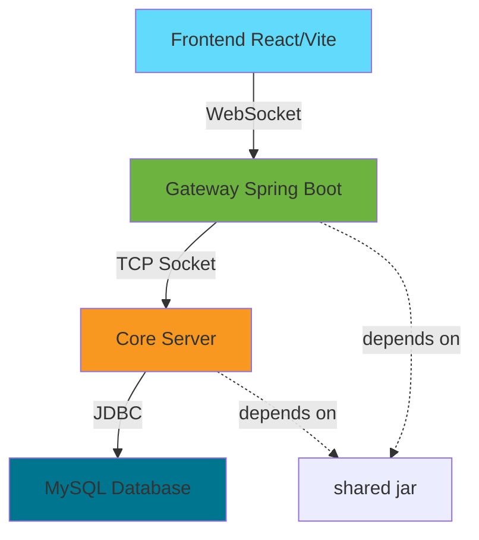

# Network Programming Project - Card Game "Rút Bài May Mắn"

## 🎯 **Project Overview**

**Đề tài**: Game Rút Bài May Mắn (Card Game Lucky Draw)  
**Môn học**: Lập trình Mạng (Network Programming)  
**Kiến trúc**: Multi-module Maven project với TCP/WebSocket communication  

---

## 📁 **Multi-Module Architecture**

Dự án được tổ chức thành nhiều module Maven con dưới một aggregator (root) pom:

```
Network-Programming/
├── pom.xml                    # Root aggregator POM
├── README.md                  # This file
│
├── core/                      # Core game logic & TCP server
│   ├── pom.xml
│   ├── src/main/java/
│   │   ├── CoreServer.java
│   │   └── network/
│   └── docs/                  # ✅ Complete documentation
│       ├── README.md
│       ├── architecture/      # System design docs
│       ├── database/          # ✅ MVP database schema
│       ├── implementation/    # Implementation guides
│       └── testing/           # Testing strategies
│
├── gateway/                   # Spring Boot gateway (WebSocket)
│   ├── pom.xml
│   ├── src/main/java/com/N9/
│   └── src/main/resources/
│       └── application.properties
│
├── shared/                    # Shared models & protocols
│   ├── pom.xml
│   ├── src/main/java/
│   │   └── MessageProtocol.java
│   └── rule.md
│
└── frontend/                  # React/Vite client (separate)
    ├── package.json
    ├── src/
    └── docs/                  # ✅ Complete frontend docs
        ├── README.md
        ├── architecture/      # Frontend architecture
        └── implementation/    # Implementation guides
```

---

## 🎮 **MVP Scope - Core Features**

### **(A) User Authentication**
- ✅ Register với username, email, password (plain text for MVP)
- ✅ Login với username/password validation
- ✅ Online status tracking (last_login within 5 minutes)
- ✅ Display online users in lobby

### **(B) Quick Match Matchmaking**
- ✅ Create game request
- ✅ Auto-match với available opponent
- ✅ Game session creation (2 players)
- 🔶 DEFERRED: Friend invitation system

### **(C) 3-Round Gameplay**
- ✅ 36-card deck (A-9 in 4 suits: ♥♦♣♠)
- ✅ 3 rounds per game
- ✅ 10-second timeout per round
- ✅ Auto-pick random card if timeout
- ✅ Simultaneous card reveal
- ✅ Round winner determination (higher card value wins)
- ✅ Display card history (all played cards)

### **(D) Game Completion**
- ✅ Total score calculation (sum of 3 rounds)
- ✅ Winner determination (highest total score)
- ✅ Statistics update (games_played, games_won, games_lost)
- ✅ Leaderboard (sort by total wins)
- ✅ Handle player quit (remaining player wins)

---

## 🗄️ **Database Schema (MVP)**

### **Active Tables**
| Table | Purpose | Status |
|-------|---------|--------|
| `users` | Authentication & accounts | ✅ ACTIVE |
| `user_profiles` | Game statistics & leaderboard | ✅ ACTIVE |
| `cards` | 36-card deck reference | ✅ ACTIVE |
| `games` | Game sessions & results | ✅ ACTIVE |
| `game_rounds` | Round-by-round tracking | ✅ ACTIVE |
| `active_sessions` | Online status & connections | ✅ ACTIVE |

### **Quick Setup**
```bash
# Initialize database
mysql -u root -p < core/docs/database/V1__cardgame_mvp.sql

# Verify
mysql -u root -p cardgame_db
SELECT suit, COUNT(*) FROM cards GROUP BY suit;
# Expected: 4 suits × 9 cards = 36 total
```

**Full Documentation**: See `core/docs/database/`
- `README.md` - Quick start guide
- `database-design.md` - Complete schema design, ERD, data dictionary
- `V1__cardgame_mvp.sql` - Executable SQL script

---

## 🏗️ **Build & Run**

### **Prerequisites**
- Java 17+
- Maven 3.8+
- MySQL 8.0+
- Node.js 18+ (for frontend)

### **Build Entire Project**
```bash
# From root directory
mvn clean package -DskipTests

# Build order (Maven reactor):
# 1. shared (jar)
# 2. core (jar)
# 3. gateway (executable jar)
```

### **Run Components**

**1. Database Setup**
```bash
mysql -u root -p < core/docs/database/V1__cardgame_mvp.sql
```

**2. Core Server (TCP)**
```bash
cd core
mvn exec:java -Dexec.mainClass="CoreServer"
# Listens on: localhost:9999 (TCP)
```

**3. Gateway (WebSocket)**
```bash
cd gateway
java -jar target/gateway-0.1.0-SNAPSHOT.jar
# Listens on: localhost:8080 (HTTP/WebSocket)
# WebSocket endpoint: ws://localhost:8080/ws/game
```

**4. Frontend (React)**
```bash
cd frontend
npm install
npm run dev
# Runs on: http://localhost:5173
```

---

## 📚 **Documentation Index**

### **Core (Backend)**
- **`core/docs/README.md`** - Core architecture overview
- **`core/docs/architecture/`**
  - `threading-model.md` - Concurrency & thread management
  - `security-guide.md` - Security implementation
- **`core/docs/database/`** ✅
  - `README.md` - Quick database setup
  - `database-design.md` - Complete schema design
  - `V1__cardgame_mvp.sql` - MVP schema + seed data
- **`core/docs/implementation/`**
  - `tcp-server-guide.md` - TCP server implementation
  - `game-logic-guide.md` - Game logic & rules
  - `roadmap-guide.md` - Development roadmap
- **`core/docs/testing/`**
  - `testing-strategy.md` - Testing approach

### **Frontend**
- **`frontend/docs/README.md`** - Frontend architecture overview
- **`frontend/docs/architecture/`**
  - `websocket-strategy.md` - WebSocket integration
  - `component-design.md` - React component architecture
  - `state-management.md` - Redux Toolkit setup
  - `security-guide.md` - Frontend security
- **`frontend/docs/implementation/`**
  - `roadmap-guide.md` - 5-week implementation plan

### **Shared**
- **`shared/rule.md`** - Game rules & business logic

---

## 🔄 **Module Dependency Flow**



**Communication Protocol**:
- Frontend ↔ Gateway: **WebSocket** (JSON messages)
- Gateway ↔ Core: **TCP Socket** (custom protocol)
- Core ↔ Database: **JDBC** (SQL queries)

---

## 🚀 **Quick Start (Development)**

### **1. Database Setup**
```bash
mysql -u root -p < core/docs/database/V1__cardgame_mvp.sql
```

### **2. Start All Services**
```bash
# Terminal 1 - Core Server
cd core && mvn exec:java -Dexec.mainClass="CoreServer"

# Terminal 2 - Gateway
cd gateway && java -jar target/gateway-0.1.0-SNAPSHOT.jar

# Terminal 3 - Frontend
cd frontend && npm run dev
```

### **3. Access Application**
- Frontend: http://localhost:5173
- Gateway API: http://localhost:8080
- WebSocket: ws://localhost:8080/ws/game

---

## 📋 **MVP Implementation Checklist**

### **Database** ✅
- [x] MySQL schema design (6 tables)
- [x] 36-card deck seeded
- [x] Foreign key constraints
- [x] Indexes for performance
- [x] Migration script ready

### **Core Server**
- [ ] TCP server listener (port 9999)
- [ ] User authentication handler
- [ ] Game logic implementation
- [ ] Round timeout handling
- [ ] Statistics update on game completion

### **Gateway**
- [ ] WebSocket endpoint configuration
- [ ] Message routing (Frontend ↔ Core)
- [ ] Session management
- [ ] CORS configuration

### **Frontend**
- [ ] Login/Register pages
- [ ] Game lobby (matchmaking)
- [ ] Game board (3 rounds)
- [ ] Leaderboard display
- [ ] Online users list

---

## 🔐 **Security Notes (MVP)**

### **⚠️ MVP Limitations (Academic Only)**
- Password stored as **plain text** (NOT for production)
- No email verification
- No account lockout
- Basic input validation only

### **🔒 Production Migration Required**
- Enable BCrypt password hashing
- Add email verification
- Implement rate limiting
- Add CSRF protection
- Enable audit logging

---

## 🧪 **Testing Strategy**

### **Unit Tests**
```bash
# Core module
cd core && mvn test

# Gateway module
cd gateway && mvn test
```

### **Integration Tests**
```bash
# Full system test
mvn verify -Pintegration-tests
```

### **Load Testing**
```bash
# 20 concurrent users
cd testing && ./load-test.sh 20
```

---

## 🛠️ **Development Workflow**

### **Adding a New Module**
1. Create module directory: `mkdir new-module`
2. Add `<module>new-module</module>` to root `pom.xml`
3. Create `new-module/pom.xml` with `<parent>` pointing to root
4. Add dependencies in module POM
5. Build: `mvn clean install`

### **Adding a New Feature**
1. Update database schema (new migration script)
2. Add core logic (core module)
3. Expose API (gateway module)
4. Implement UI (frontend)
5. Add tests (all layers)
6. Update documentation

---

## 📖 **Best Practices**

### **Maven Multi-Module**
- ✅ Use root POM for dependency management
- ✅ Keep module versions in sync
- ✅ Shared dependencies in `<dependencyManagement>`
- ✅ Plugin configuration in `<pluginManagement>`
- ⚠️ Don't mix Spring Boot parent in child modules

### **Database**
- ✅ Use migrations (Flyway/Liquibase)
- ✅ Always add indexes for foreign keys
- ✅ Use transactions for game operations
- ✅ Mark DEFERRED fields with comments
- ⚠️ Never drop columns (mark as DEFERRED instead)

### **Coding Standards**
- ✅ Java: Google Java Style Guide
- ✅ JavaScript/React: Airbnb Style Guide
- ✅ SQL: snake_case naming
- ✅ Comments in Vietnamese for business logic
- ✅ Documentation in Markdown

---

## 🆘 **Troubleshooting**

### **Build Fails**
```bash
# Clean all modules
mvn clean

# Rebuild with dependency resolution
mvn clean install -U

# Skip tests if needed
mvn clean install -DskipTests
```

### **Database Connection Issues**
```bash
# Check MySQL service
sudo systemctl status mysql

# Test connection
mysql -u cardgame_user -p cardgame_db

# Verify schema
SHOW TABLES;
```

### **Port Already in Use**
```bash
# Find process using port
netstat -ano | findstr :8080  # Windows
lsof -i :8080                  # Linux/Mac

# Kill process
taskkill /PID <pid> /F         # Windows
kill -9 <pid>                  # Linux/Mac
```

---

## 🎓 **Learning Resources**

- **Maven Multi-Module**: https://maven.apache.org/guides/mini/guide-multiple-modules.html
- **Spring Boot**: https://spring.io/guides
- **React**: https://react.dev/learn
- **MySQL**: https://dev.mysql.com/doc/
- **WebSocket**: https://developer.mozilla.org/en-US/docs/Web/API/WebSocket

---

## 📝 **License & Credits**

**Project**: Academic project for Network Programming course  
**Team**: N9  
**Instructor**: [Instructor Name]  
**Year**: 2024-2025  

---

## 📞 **Contact & Support**

**Issues**: Create issue in repository  
**Documentation**: See `*/docs/` directories  
**Questions**: Contact team leads  

---

**Happy Coding! 🚀**
- Giữ pom module gọn: chỉ khai báo phần đặc thù (dependencies, build) còn lại để root quản lý.

Khắc phục sự cố thường gặp
- Module không được nhận dạng: kiểm tra <modules> trong root và relativePath của parent trong module pom.
- Phiên bản không đồng nhất: kiểm tra groupId/version ở root và đảm bảo module kế thừa.
- Spring Boot repackage lỗi: đảm bảo spring-boot-maven-plugin có trong build/plugins của module ứng dụng (gateway) hoặc được cấu hình trong pluginManagement của root.

Kết luận
- Kiến trúc multi-module phù hợp cho dự án có nhiều thành phần tách biệt (library + ứng dụng).
- Hiện tại dự án đã được cấu hình để root làm aggregator và Spring Boot parent, các module con kế thừa root, đảm bảo nhất quán và dễ bảo trì.


