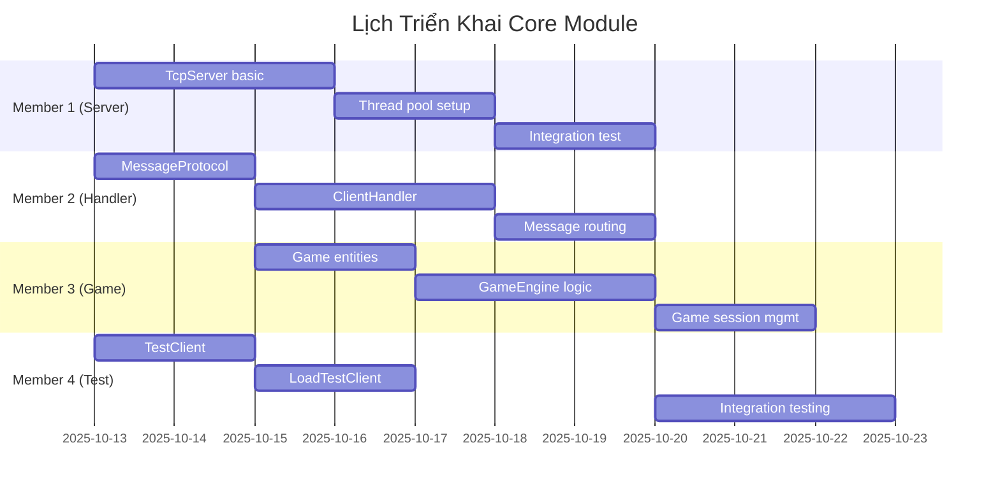

# 🚀 Hướng Dẫn Triển Khai Core - Game Rút Bài May Mắn

## 📋 Tổng Quan

**Mục tiêu**: Xây dựng Core Server bằng Java thuần, sử dụng TCP Socket và đa luồng theo mô hình MVP (Minimum Viable Product).

**Phạm vi**: Chỉ tập trung vào Core module, không bao gồm Gateway hay Frontend.

**Nguyên tắc MVP**:
- ✅ Chức năng cốt lõi hoạt động được
- ✅ Code đơn giản, dễ hiểu, ổn định
- ✅ Có thể demo được với nhiều client
- ❌ Không tối ưu hóa sớm
- ❌ Không áp dụng design pattern phức tạp

---

## 🏗️ 1. Kiến Trúc Core Module

### 1.1. Cấu Trúc Thư Mục

```
core/
├── pom.xml
├── src/main/java/com/n9/core/
│   ├── CoreServer.java           # Main class khởi động server
│   ├── network/
│   │   ├── TcpServer.java        # TCP Socket Server
│   │   ├── ClientHandler.java    # Xử lý từng client
│   │   └── MessageProtocol.java  # Định nghĩa format message
│   ├── game/
│   │   ├── GameEngine.java       # Logic game chính
│   │   ├── Card.java            # Đối tượng lá bài
│   │   ├── Player.java          # Đối tượng người chơi
│   │   └── GameSession.java     # Session một ván chơi
│   ├── db/
│   │   ├── DatabaseManager.java  # Quản lý kết nối DB
│   │   └── UserDAO.java         # Truy cập dữ liệu user
│   └── utils/
│       ├── Logger.java          # Log đơn giản
│       └── ConfigManager.java   # Cấu hình server
└── src/test/java/
    ├── TestClient.java          # Client giả lập để test
    └── LoadTestClient.java      # Test tải với nhiều client
```

### 1.2. Sơ Đồ Kiến Trúc

```
┌─────────────────┐    ┌─────────────────┐    ┌─────────────────┐
│   Test Client   │    │   Test Client   │    │   Test Client   │
│   (Player 1)    │    │   (Player 2)    │    │   (Player N)    │
└─────────┬───────┘    └─────────┬───────┘    └─────────┬───────┘
          │ TCP Socket           │ TCP Socket           │ TCP Socket
          └──────────┬───────────┴───────────┬──────────┘
                     │                       │
              ┌──────▼──────────────────────▼──────┐
              │         TcpServer               │
              │   (ServerSocket + Thread Pool)  │
              └──────┬──────────────────────────┘
                     │
                     ▼
              ┌─────────────────┐
              │  ClientHandler  │ ◄─── Một thread cho mỗi client
              │ (Runnable task) │
              └─────────┬───────┘
                        │
                        ▼
              ┌─────────────────┐
              │   GameEngine    │ ◄─── Xử lý logic game
              │  (Game Logic)   │
              └─────────┬───────┘
                        │
                        ▼
              ┌─────────────────┐
              │ DatabaseManager │ ◄─── Lưu trữ kết quả
              │   (JDBC + DAO)  │
              └─────────────────┘
```

---

## 📝 2. Lộ Trình Triển Khai Từng Bước

### 2.1. Giai Đoạn 1: Cơ Sở Hạ Tầng (Ưu tiên 1️⃣)

**Thời gian**: 2-3 ngày  
**Mức độ phức tạp**: 🟡 Trung bình  
**Người thực hiện**: Member 1 (Server & Thread)

#### Bước 1.1: Cấu hình Maven POM
```xml
<!-- core/pom.xml -->
<project>
    <modelVersion>4.0.0</modelVersion>
    <groupId>com.n9</groupId>
    <artifactId>core</artifactId>
    <version>1.0.0</version>
    
    <properties>
        <maven.compiler.source>17</maven.compiler.source>
        <maven.compiler.target>17</maven.compiler.target>
        <project.build.sourceEncoding>UTF-8</project.build.sourceEncoding>
    </properties>
    
    <dependencies>
        <!-- MySQL JDBC Driver -->
        <dependency>
            <groupId>mysql</groupId>
            <artifactId>mysql-connector-java</artifactId>
            <version>8.0.33</version>
        </dependency>
        
        <!-- JSON Processing -->
        <dependency>
            <groupId>com.fasterxml.jackson.core</groupId>
            <artifactId>jackson-databind</artifactId>
            <version>2.15.0</version>
        </dependency>
        
        <!-- Connection Pool -->
        <dependency>
            <groupId>com.zaxxer</groupId>
            <artifactId>HikariCP</artifactId>
            <version>5.0.1</version>
        </dependency>
    </dependencies>
</project>
```

#### Bước 1.2: Tạo TcpServer Cơ Bản
```java
// src/main/java/com/n9/core/network/TcpServer.java
package com.n9.core.network;

import java.io.IOException;
import java.net.ServerSocket;
import java.net.Socket;
import java.util.concurrent.ExecutorService;
import java.util.concurrent.Executors;

public class TcpServer {
    private static final int PORT = 5000;
    private static final int THREAD_POOL_SIZE = 20;
    
    private ServerSocket serverSocket;
    private ExecutorService threadPool;
    private boolean isRunning = false;
    
    public void start() {
        try {
            serverSocket = new ServerSocket(PORT);
            threadPool = Executors.newFixedThreadPool(THREAD_POOL_SIZE);
            isRunning = true;
            
            System.out.println("🚀 Core Server started on port " + PORT);
            
            // Vòng lặp chấp nhận kết nối
            while (isRunning) {
                Socket clientSocket = serverSocket.accept();
                
                // Tạo ClientHandler cho mỗi kết nối
                ClientHandler handler = new ClientHandler(clientSocket);
                threadPool.submit(handler);
                
                System.out.println("✅ New client connected: " + 
                    clientSocket.getRemoteSocketAddress());
            }
            
        } catch (IOException e) {
            System.err.println("❌ Server error: " + e.getMessage());
        }
    }
    
    public void stop() {
        isRunning = false;
        try {
            if (serverSocket != null) serverSocket.close();
            if (threadPool != null) threadPool.shutdown();
            System.out.println("🛑 Server stopped");
        } catch (IOException e) {
            System.err.println("❌ Error stopping server: " + e.getMessage());
        }
    }
}
```

#### Bước 1.3: Test Server Cơ Bản
```java
// src/main/java/com/n9/core/CoreServer.java
package com.n9.core;

import com.n9.core.network.TcpServer;

public class CoreServer {
    public static void main(String[] args) {
        TcpServer server = new TcpServer();
        
        // Hook để tắt server khi Ctrl+C
        Runtime.getRuntime().addShutdownHook(new Thread(() -> {
            System.out.println("\n🔄 Shutting down server...");
            server.stop();
        }));
        
        server.start();
    }
}
```

**✅ Kiểm tra**: Chạy server, dùng `telnet localhost 5000` để test kết nối.

---

### 2.2. Giai Đoạn 2: Message Protocol & ClientHandler (Ưu tiên 2️⃣)

**Thời gian**: 2-3 ngày  
**Mức độ phức tạp**: 🟡 Trung bình  
**Người thực hiện**: Member 2 (Message & Handler)

#### Bước 2.1: Định Nghĩa Message Protocol
```java
// src/main/java/com/n9/core/network/MessageProtocol.java
package com.n9.core.network;

import com.fasterxml.jackson.databind.ObjectMapper;
import com.fasterxml.jackson.databind.JsonNode;

public class MessageProtocol {
    private static final ObjectMapper mapper = new ObjectMapper();
    
    // Message types
    public static final String LOGIN = "LOGIN";
    public static final String DRAW_CARD = "DRAW_CARD";
    public static final String GAME_RESULT = "GAME_RESULT";
    public static final String ERROR = "ERROR";
    
    // Tạo message JSON
    public static String createMessage(String type, Object data) {
        try {
            var message = mapper.createObjectNode();
            message.put("type", type);
            message.put("timestamp", System.currentTimeMillis());
            message.set("data", mapper.valueToTree(data));
            return message.toString();
        } catch (Exception e) {
            return createErrorMessage("Failed to create message: " + e.getMessage());
        }
    }
    
    // Parse message từ JSON
    public static JsonNode parseMessage(String jsonMessage) {
        try {
            return mapper.readTree(jsonMessage);
        } catch (Exception e) {
            System.err.println("❌ Invalid message format: " + jsonMessage);
            return null;
        }
    }
    
    // Tạo error message
    public static String createErrorMessage(String error) {
        try {
            var message = mapper.createObjectNode();
            message.put("type", ERROR);
            message.put("error", error);
            return message.toString();
        } catch (Exception e) {
            return "{\"type\":\"ERROR\",\"error\":\"Internal server error\"}";
        }
    }
}
```

#### Bước 2.2: Xây Dựng ClientHandler
```java
// src/main/java/com/n9/core/network/ClientHandler.java
package com.n9.core.network;

import com.fasterxml.jackson.databind.JsonNode;
import java.io.*;
import java.net.Socket;

public class ClientHandler implements Runnable {
    private Socket clientSocket;
    private BufferedReader reader;
    private PrintWriter writer;
    private String playerId;
    private boolean isConnected = true;
    
    public ClientHandler(Socket socket) {
        this.clientSocket = socket;
        try {
            this.reader = new BufferedReader(
                new InputStreamReader(socket.getInputStream()));
            this.writer = new PrintWriter(
                socket.getOutputStream(), true);
        } catch (IOException e) {
            System.err.println("❌ Failed to create ClientHandler: " + e.getMessage());
        }
    }
    
    @Override
    public void run() {
        try {
            // Gửi welcome message
            sendMessage(MessageProtocol.createMessage("WELCOME", 
                "Connected to Core Server"));
            
            String inputMessage;
            while (isConnected && (inputMessage = reader.readLine()) != null) {
                processMessage(inputMessage);
            }
            
        } catch (IOException e) {
            System.err.println("❌ Client disconnected: " + e.getMessage());
        } finally {
            cleanup();
        }
    }
    
    private void processMessage(String messageStr) {
        JsonNode message = MessageProtocol.parseMessage(messageStr);
        if (message == null) {
            sendMessage(MessageProtocol.createErrorMessage("Invalid message format"));
            return;
        }
        
        String type = message.get("type").asText();
        System.out.println("📨 Received: " + type + " from " + playerId);
        
        switch (type) {
            case MessageProtocol.LOGIN:
                handleLogin(message);
                break;
            case MessageProtocol.DRAW_CARD:
                handleDrawCard(message);
                break;
            default:
                sendMessage(MessageProtocol.createErrorMessage("Unknown message type: " + type));
        }
    }
    
    private void handleLogin(JsonNode message) {
        // TODO: Implement login logic
        JsonNode data = message.get("data");
        String username = data.get("username").asText();
        
        this.playerId = username; // Simplified for MVP
        
        var response = new java.util.HashMap<String, Object>();
        response.put("playerId", playerId);
        response.put("status", "success");
        
        sendMessage(MessageProtocol.createMessage("LOGIN_SUCCESS", response));
    }
    
    private void handleDrawCard(JsonNode message) {
        // TODO: Implement draw card logic
        var response = new java.util.HashMap<String, Object>();
        response.put("card", "A♠"); // Mock data
        response.put("playerId", playerId);
        
        sendMessage(MessageProtocol.createMessage("CARD_DRAWN", response));
    }
    
    public void sendMessage(String message) {
        if (writer != null) {
            writer.println(message);
            System.out.println("📤 Sent: " + message.substring(0, 
                Math.min(50, message.length())) + "...");
        }
    }
    
    private void cleanup() {
        isConnected = false;
        try {
            if (reader != null) reader.close();
            if (writer != null) writer.close();
            if (clientSocket != null) clientSocket.close();
            System.out.println("🧹 Client " + playerId + " cleaned up");
        } catch (IOException e) {
            System.err.println("❌ Error during cleanup: " + e.getMessage());
        }
    }
}
```

**✅ Kiểm tra**: Gửi JSON message qua telnet và xem response.

---

### 2.3. Giai Đoạn 3: Game Logic Cơ Bản (Ưu tiên 3️⃣)

**Thời gian**: 3-4 ngày  
**Mức độ phức tạp**: 🟠 Cao  
**Người thực hiện**: Member 3 (Game Logic)

#### Bước 3.1: Tạo Các Class Game Cơ Bản
```java
// src/main/java/com/n9/core/game/Card.java
package com.n9.core.game;

public class Card {
    public enum Suit { HEARTS, DIAMONDS, CLUBS, SPADES }
    public enum Rank { 
        THREE(3), FOUR(4), FIVE(5), SIX(6), SEVEN(7), EIGHT(8), 
        NINE(9), TEN(10), JACK(11), QUEEN(12), KING(13), ACE(14), TWO(15);
        
        private final int value;
        Rank(int value) { this.value = value; }
        public int getValue() { return value; }
    }
    
    private final Rank rank;
    private final Suit suit;
    
    public Card(Rank rank, Suit suit) {
        this.rank = rank;
        this.suit = suit;
    }
    
    // Getters
    public Rank getRank() { return rank; }
    public Suit getSuit() { return suit; }
    public int getValue() { return rank.getValue(); }
    
    @Override
    public String toString() {
        return rank + "♠♥♦♣".substring(suit.ordinal(), suit.ordinal() + 1);
    }
}
```

```java
// src/main/java/com/n9/core/game/Player.java
package com.n9.core.game;

import java.util.ArrayList;
import java.util.List;

public class Player {
    private String playerId;
    private String username;
    private List<Card> hand;
    private int score;
    
    public Player(String playerId, String username) {
        this.playerId = playerId;
        this.username = username;
        this.hand = new ArrayList<>();
        this.score = 0;
    }
    
    public void addCard(Card card) {
        hand.add(card);
    }
    
    public Card playCard(int index) {
        if (index >= 0 && index < hand.size()) {
            return hand.remove(index);
        }
        return null;
    }
    
    public void addScore(int points) {
        this.score += points;
    }
    
    // Getters
    public String getPlayerId() { return playerId; }
    public String getUsername() { return username; }
    public List<Card> getHand() { return hand; }
    public int getScore() { return score; }
    public int getHandSize() { return hand.size(); }
}
```

#### Bước 3.2: Game Engine Đơn Giản
```java
// src/main/java/com/n9/core/game/GameEngine.java
package com.n9.core.game;

import java.util.*;
import java.util.concurrent.ConcurrentHashMap;

public class GameEngine {
    private static GameEngine instance;
    private Map<String, Player> players;
    private List<Card> deck;
    private Random random;
    
    private GameEngine() {
        this.players = new ConcurrentHashMap<>();
        this.random = new Random();
        initializeDeck();
    }
    
    public static GameEngine getInstance() {
        if (instance == null) {
            instance = new GameEngine();
        }
        return instance;
    }
    
    private void initializeDeck() {
        deck = new ArrayList<>();
        for (Card.Suit suit : Card.Suit.values()) {
            for (Card.Rank rank : Card.Rank.values()) {
                deck.add(new Card(rank, suit));
            }
        }
    }
    
    public synchronized Player loginPlayer(String playerId, String username) {
        Player player = new Player(playerId, username);
        players.put(playerId, player);
        System.out.println("🎮 Player logged in: " + username);
        return player;
    }
    
    public synchronized Card drawCard(String playerId) {
        if (deck.isEmpty()) {
            initializeDeck(); // Reset deck when empty
            Collections.shuffle(deck);
        }
        
        Card card = deck.remove(random.nextInt(deck.size()));
        
        Player player = players.get(playerId);
        if (player != null) {
            player.addCard(card);
            System.out.println("🃏 " + playerId + " drew: " + card);
        }
        
        return card;
    }
    
    public synchronized Map<String, Object> compareCards(String player1Id, String player2Id) {
        Player p1 = players.get(player1Id);
        Player p2 = players.get(player2Id);
        
        if (p1 == null || p2 == null || p1.getHandSize() == 0 || p2.getHandSize() == 0) {
            return null;
        }
        
        // Lấy lá bài đầu tiên của mỗi người (đơn giản hóa)
        Card card1 = p1.getHand().get(0);
        Card card2 = p2.getHand().get(0);
        
        String winner;
        if (card1.getValue() > card2.getValue()) {
            winner = player1Id;
            p1.addScore(1);
        } else if (card2.getValue() > card1.getValue()) {
            winner = player2Id;
            p2.addScore(1);
        } else {
            winner = "DRAW";
        }
        
        Map<String, Object> result = new HashMap<>();
        result.put("winner", winner);
        result.put("player1Card", card1.toString());
        result.put("player2Card", card2.toString());
        result.put("player1Score", p1.getScore());
        result.put("player2Score", p2.getScore());
        
        return result;
    }
    
    public Player getPlayer(String playerId) {
        return players.get(playerId);
    }
    
    public int getPlayerCount() {
        return players.size();
    }
}
```

**✅ Kiểm tra**: Test login, draw card và so sánh bài qua message JSON.

---

### 2.4. Giai Đoạn 4: Test & Debug (Ưu tiên 4️⃣)

**Thời gian**: 2 ngày  
**Mức độ phức tạp**: 🟢 Thấp  
**Người thực hiện**: Member 4 (Test & Debug)

#### Bước 4.1: Test Client Đơn Giản
```java
// src/test/java/TestClient.java
import java.io.*;
import java.net.*;

public class TestClient {
    public static void main(String[] args) {
        try (Socket socket = new Socket("localhost", 5000);
             PrintWriter out = new PrintWriter(socket.getOutputStream(), true);
             BufferedReader in = new BufferedReader(new InputStreamReader(socket.getInputStream()))) {
            
            System.out.println("🔗 Connected to server");
            
            // Test login
            String loginMessage = "{\"type\":\"LOGIN\",\"data\":{\"username\":\"testPlayer1\"}}";
            out.println(loginMessage);
            System.out.println("📤 Sent: " + loginMessage);
            
            String response = in.readLine();
            System.out.println("📥 Received: " + response);
            
            // Test draw card
            String drawMessage = "{\"type\":\"DRAW_CARD\",\"data\":{}}";
            out.println(drawMessage);
            System.out.println("📤 Sent: " + drawMessage);
            
            response = in.readLine();
            System.out.println("📥 Received: " + response);
            
        } catch (IOException e) {
            System.err.println("❌ Client error: " + e.getMessage());
        }
    }
}
```

#### Bước 4.2: Load Test Client
```java
// src/test/java/LoadTestClient.java
import java.util.concurrent.ExecutorService;
import java.util.concurrent.Executors;

public class LoadTestClient {
    public static void main(String[] args) {
        int clientCount = 5;
        ExecutorService executor = Executors.newFixedThreadPool(clientCount);
        
        for (int i = 0; i < clientCount; i++) {
            final int clientId = i;
            executor.submit(() -> {
                try (Socket socket = new Socket("localhost", 5000);
                     PrintWriter out = new PrintWriter(socket.getOutputStream(), true);
                     BufferedReader in = new BufferedReader(new InputStreamReader(socket.getInputStream()))) {
                    
                    // Login
                    String loginMessage = "{\"type\":\"LOGIN\",\"data\":{\"username\":\"player" + clientId + "\"}}";
                    out.println(loginMessage);
                    System.out.println("Client " + clientId + " logged in");
                    
                    // Read response
                    String response = in.readLine();
                    System.out.println("Client " + clientId + " response: " + response);
                    
                    // Keep connection alive for 10 seconds
                    Thread.sleep(10000);
                    
                } catch (Exception e) {
                    System.err.println("Client " + clientId + " error: " + e.getMessage());
                }
            });
        }
        
        executor.shutdown();
    }
}
```

---

## 👥 3. Phân Công Nhóm 4 Người (Chi Tiết)

### 3.1. Phân Chia Trách Nhiệm

| Thành Viên | Module Phụ Trách | Nhiệm Vụ Cụ Thể | Timeline |
|------------|------------------|------------------|----------|
| **Member 1** | **Server & Threading** | - `TcpServer.java`<br>- `CoreServer.java` (main)<br>- Thread pool management<br>- Server lifecycle | Tuần 1-2 |
| **Member 2** | **Message & Handler** | - `MessageProtocol.java`<br>- `ClientHandler.java`<br>- JSON parsing/creation<br>- Message routing | Tuần 1-2 |
| **Member 3** | **Game Logic** | - `GameEngine.java`<br>- `Card.java`, `Player.java`<br>- Game rules & scoring<br>- Session management | Tuần 2-3 |
| **Member 4** | **Test & Integration** | - `TestClient.java`<br>- `LoadTestClient.java`<br>- Debugging & logging<br>- Documentation | Tuần 1-4 |

### 3.2. Workflow Phối Hợp



### 3.3. Điểm Đồng Bộ (Sync Points)

**Day 3**: Tất cả hoàn thành setup cơ bản
- Member 1: TcpServer chạy được
- Member 2: MessageProtocol định nghĩa xong
- Member 3: Card, Player class hoàn thành
- Member 4: TestClient cơ bản

**Day 6**: Tích hợp lần 1
- Tất cả: Test kết nối và message đơn giản
- Fix bugs cơ bản

**Day 9**: MVP hoàn thành
- Game logic hoạt động
- Load test thành công
- Documentation đầy đủ

---

## 🧪 4. Quy Trình Kiểm Thử

### 4.1. Test Cục Bộ (Local Testing)

#### Test 1: Kết Nối Cơ Bản
```bash
# Terminal 1: Khởi động server
cd core
mvn compile exec:java -Dexec.mainClass="com.n9.core.CoreServer"

# Terminal 2: Test bằng telnet
telnet localhost 5000
```

**Kết quả mong đợi**:
```
Connected to localhost.
Escape character is '^]'.
{"type":"WELCOME","timestamp":1697123456789,"data":"Connected to Core Server"}
```

#### Test 2: Message JSON
```bash
# Gửi trong telnet session:
{"type":"LOGIN","data":{"username":"testUser"}}

# Kết quả mong đợi:
{"type":"LOGIN_SUCCESS","timestamp":1697123456789,"data":{"playerId":"testUser","status":"success"}}
```

#### Test 3: Draw Card
```bash
# Gửi:
{"type":"DRAW_CARD","data":{}}

# Kết quả mong đợi:
{"type":"CARD_DRAWN","timestamp":1697123456789,"data":{"card":"A♠","playerId":"testUser"}}
```

### 4.2. Load Testing

```bash
# Compile test classes
javac -cp target/classes src/test/java/*.java -d target/test-classes

# Run load test
java -cp target/classes:target/test-classes LoadTestClient
```

**Metrics cần theo dõi**:
- Số client kết nối đồng thời: Tối thiểu 5, mục tiêu 20
- Response time: < 100ms cho message đơn giản
- Memory usage: < 500MB với 20 clients
- No crashes sau 10 phút load test

### 4.3. Debugging & Logging

#### Simple Logger
```java
// src/main/java/com/n9/core/utils/Logger.java
package com.n9.core.utils;

import java.time.LocalDateTime;
import java.time.format.DateTimeFormatter;

public class Logger {
    private static final DateTimeFormatter formatter = 
        DateTimeFormatter.ofPattern("yyyy-MM-dd HH:mm:ss");
    
    public static void info(String message) {
        System.out.println("[INFO] " + LocalDateTime.now().format(formatter) + " - " + message);
    }
    
    public static void error(String message) {
        System.err.println("[ERROR] " + LocalDateTime.now().format(formatter) + " - " + message);
    }
    
    public static void debug(String message) {
        System.out.println("[DEBUG] " + LocalDateTime.now().format(formatter) + " - " + message);
    }
}
```

**Sử dụng trong code**:
```java
Logger.info("Server started on port 5000");
Logger.debug("Processing message: " + messageType);
Logger.error("Failed to process client request: " + e.getMessage());
```

---

## 🎯 5. Định Hướng Đạt Điểm Cao

### 5.1. Tiêu Chí Đánh Giá Của Giảng Viên

| Tiêu Chí | Trọng Số | Cách Thực Hiện |
|----------|----------|----------------|
| **Kết nối đa client** | 25% | - Test được 10+ clients đồng thời<br>- Demo real-time với 2-3 clients |
| **Xử lý đồng thời ổn định** | 25% | - Không crash khi nhiều request<br>- Thread-safe operations<br>- Proper resource cleanup |
| **Logic game hoạt động** | 25% | - Draw card, compare cards<br>- Score tracking<br>- Game session management |
| **Code quality & docs** | 25% | - Clear class structure<br>- Comprehensive logging<br>- Complete documentation |

### 5.2. Demo Script

```bash
# 1. Khởi động server
java -jar core-server.jar

# 2. Kết nối Client 1
java TestClient "player1"

# 3. Kết nối Client 2  
java TestClient "player2"

# 4. Chơi game
# Player 1 draws card -> A♠
# Player 2 draws card -> K♥  
# Compare -> Player 1 wins (Ace > King)

# 5. Load test
java LoadTestClient 15  # 15 concurrent clients

# 6. Show logs
tail -f server.log
```

### 5.3. Checklist MVP Core

- [ ] **TCP Server**
  - [ ] ServerSocket lắng nghe port 5000
  - [ ] Thread pool xử lý 20+ clients đồng thời
  - [ ] Graceful shutdown với Ctrl+C
  
- [ ] **Message Protocol** 
  - [ ] JSON format với type, timestamp, data
  - [ ] LOGIN, DRAW_CARD, GAME_RESULT messages
  - [ ] Error handling với clear error messages
  
- [ ] **Game Logic**
  - [ ] 52-card deck với proper Card class
  - [ ] Player management với score tracking
  - [ ] Card comparison logic (high card wins)
  
- [ ] **Testing**
  - [ ] TestClient có thể login và draw cards
  - [ ] LoadTestClient test 10+ concurrent connections
  - [ ] No memory leaks sau 30 phút chạy liên tục
  
- [ ] **Documentation**
  - [ ] README với hướng dẫn compile & run
  - [ ] Code comments cho major methods
  - [ ] Demo script cho presentation

---

## 🔄 6. Git Workflow Đơn Giản

### 6.1. Branch Strategy
```
main (stable, demo-ready)
├── feature/tcp-server     (Member 1)
├── feature/message-handler (Member 2) 
├── feature/game-logic     (Member 3)
└── feature/testing        (Member 4)
```

### 6.2. Workflow Commands
```bash
# Tạo feature branch
git checkout -b feature/tcp-server

# Commit thường xuyên
git add .
git commit -m "Add basic TcpServer with thread pool"

# Push lên remote
git push origin feature/tcp-server

# Merge khi hoàn thành
git checkout main
git merge feature/tcp-server
git push origin main
```

### 6.3. Commit Message Convention
```
✅ Add: Thêm tính năng mới
🐛 Fix: Sửa bug  
📝 Docs: Cập nhật documentation
🧪 Test: Thêm hoặc sửa tests
♻️ Refactor: Tối ưu code không thay đổi logic
```

**Ví dụ**:
```
✅ Add basic TCP server with thread pool support
🐛 Fix client disconnect handling in ClientHandler  
📝 Docs: Update setup instructions in README
🧪 Test: Add load test for 20 concurrent clients
```

---

## 🎉 7. Tổng Kết

### 7.1. Deliverables
Sau khi hoàn thành hướng dẫn này, nhóm sẽ có:

1. **Core Server hoạt động** với TCP socket và đa luồng
2. **Message protocol** rõ ràng với JSON format
3. **Game logic cơ bản** cho Lucky Card Draw
4. **Test suite** đầy đủ với load testing
5. **Documentation** chi tiết cho maintenance

### 7.2. Thời Gian Thực Hiện
- **Total**: 9-12 ngày làm việc
- **4 người**: 2.5-3 tuần calendar time  
- **MVP ready**: Có thể demo sau tuần 2

### 7.3. Mở Rộng Sau MVP
Sau khi MVP ổn định, có thể mở rộng:
- Database integration (lưu game history)
- Authentication & user management  
- Multiple game rooms
- Tournament mode
- WebSocket gateway integration

---

**🚀 Bắt đầu ngay với Giai đoạn 1: Member 1 setup TcpServer, Member 2 thiết kế MessageProtocol!**

---

*Tài liệu được tạo ngày: 13/10/2025*  
*Phiên bản: MVP 1.0*  
*Tác giả: Team Lead & Technical Mentor*