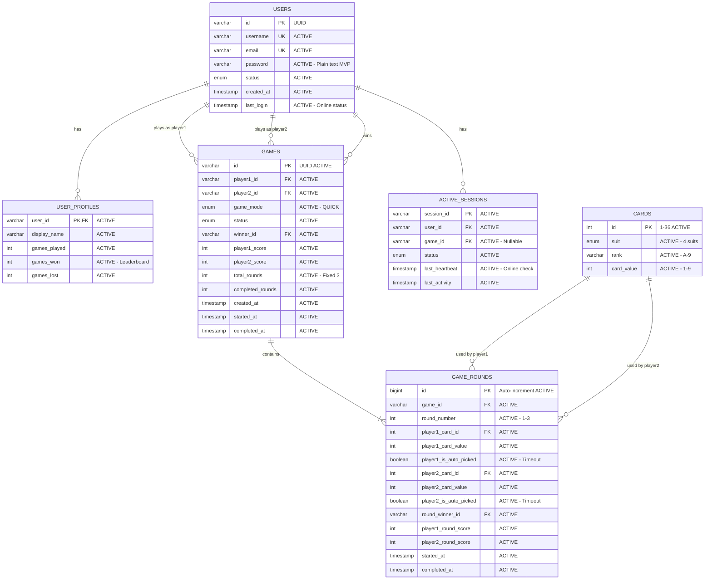

# Database Design - MVP Schema Documentation

## 🎯 **DATABASE STRATEGY OVERVIEW**

### **MVP Scope & Objectives**

Database architecture được thiết kế **tối giản hóa cho MVP** nhưng **giữ khả năng mở rộng** để hỗ trợ:

**(A) Đăng ký/Đăng nhập** - User authentication với plain text password (MVP only)  
**(B) Tạo & Ghép trận nhanh** - Quick matchmaking cho 2 người chơi  
**(C) Chơi theo round** - 3 vòng chơi, mỗi vòng 10 giây timeout, auto-pick nếu hết giờ  
**(D) Kết thúc ván** - Tổng điểm, xác định thắng/thua, cập nhật leaderboard đơn giản  

### **Database Selection: MySQL 8.0+**

**Strategic Rationale:**
- ✅ **ACID Compliance**: Đảm bảo tính nhất quán dữ liệu game
- ✅ **InnoDB Engine**: Row-level locking cho concurrency cao
- ✅ **Simple Setup**: Dễ triển khai cho môi trường học thuật
- ✅ **Team Familiarity**: MySQL phổ biến, dễ học, dễ debug
- ✅ **UTF8MB4 Support**: Hỗ trợ Unicode đầy đủ cho tên người chơi

### **MVP Performance Requirements**
- **Concurrent Users**: 20-50 người chơi đồng thời
- **Response Time**: < 100ms cho các truy vấn chính
- **Data Consistency**: ACID compliance cho game state
- **Card Deck**: 36 lá (A-9, 4 chất: ♥♦♣♠)

---

## 🏗️ **MVP DATABASE SCHEMA DESIGN**

### **Entity Relationship Diagram (ERD)**



### **Table Purpose Summary**

| Table | Status | Purpose (MVP) | Key Fields |
|-------|--------|---------------|------------|
| **users** | ✅ ACTIVE | Authentication, account management | username, password, last_login |
| **user_profiles** | ✅ ACTIVE | Game statistics, leaderboard | games_won, games_played |
| **cards** | ✅ ACTIVE | 36-card deck reference | suit, rank, card_value |
| **games** | ✅ ACTIVE | Game sessions, results tracking | status, winner_id, scores |
| **game_rounds** | ✅ ACTIVE | Round-by-round gameplay | card_ids, is_auto_picked, winner |
| **active_sessions** | ✅ ACTIVE | Online status, connection tracking | last_heartbeat, status |
| ~~leaderboards~~ | 🔶 DEFERRED | Advanced ranking (use `games_won` for MVP) | - |
| ~~audit_logs~~ | 🔶 DEFERRED | Security audit trail | - |
| ~~user_statistics~~ | 🔶 DEFERRED | Detailed analytics | - |

---

## 📖 **DATA DICTIONARY**

### **1. Table: `users`**
**Purpose**: Core user authentication and account management  
**Status**: ✅ **ACTIVE** (MVP Critical)  
**Relationships**: 
- One-to-One with `user_profiles`
- One-to-Many with `games` (as player1, player2, winner)
- One-to-Many with `active_sessions`

| Column | Type | Null | Default | Key | Status | Description |
|--------|------|------|---------|-----|--------|-------------|
| `id` | VARCHAR(50) | NO | - | PK | ✅ ACTIVE | UUID identifier (generated by application) |
| `username` | VARCHAR(50) | NO | - | UK | ✅ ACTIVE | Unique login username (3-20 chars, alphanumeric) |
| `email` | VARCHAR(100) | NO | - | UK | ✅ ACTIVE | Email address (validation in app layer) |
| `password` | VARCHAR(255) | NO | - | - | ✅ ACTIVE | **MVP: Plain text**. DEFERRED: BCrypt hash |
| `status` | ENUM | NO | 'ACTIVE' | IDX | ✅ ACTIVE | Account status (ACTIVE/SUSPENDED/BANNED) |
| `created_at` | TIMESTAMP | NO | NOW() | - | ✅ ACTIVE | Registration timestamp |
| `last_login` | TIMESTAMP | YES | NULL | IDX | ✅ ACTIVE | **Last login for online status** (< 5 min = online) |
| `updated_at` | TIMESTAMP | NO | NOW() | - | 🔶 DEFERRED | Auto-update timestamp |
| `email_verified` | BOOLEAN | NO | FALSE | - | 🔶 DEFERRED | Email verification flag |
| `failed_login_attempts` | INT | NO | 0 | - | 🔶 DEFERRED | Failed login counter for lockout |
| `locked_until` | TIMESTAMP | YES | NULL | - | 🔶 DEFERRED | Account lockout expiration |

**Indexes:**
- PRIMARY KEY (`id`)
- UNIQUE KEY (`username`)
- UNIQUE KEY (`email`)
- INDEX `idx_status` (`status`) - Filter active users
- INDEX `idx_last_login` (`last_login`) - **Query online users**

**Business Rules:**
- Username: 3-20 characters, alphanumeric + underscore/hyphen
- Password: Min 6 characters for MVP (DEFERRED: 8+ with complexity)
- Online status: `last_login` within 5 minutes = online

---

### **2. Table: `user_profiles`**
**Purpose**: Game statistics and simple leaderboard data  
**Status**: ✅ **ACTIVE** (MVP Critical)  
**Relationships**: 
- One-to-One with `users` (CASCADE delete)

| Column | Type | Null | Default | Key | Status | Description |
|--------|------|------|---------|-----|--------|-------------|
| `user_id` | VARCHAR(50) | NO | - | PK,FK | ✅ ACTIVE | Foreign key to users.id |
| `display_name` | VARCHAR(100) | YES | NULL | - | ✅ ACTIVE | Display name in lobby/leaderboard (nullable = use username) |
| `games_played` | INT | NO | 0 | IDX | ✅ ACTIVE | Total completed games |
| `games_won` | INT | NO | 0 | IDX | ✅ ACTIVE | **PRIMARY LEADERBOARD METRIC** (sort DESC) |
| `games_lost` | INT | NO | 0 | - | ✅ ACTIVE | Total losses (win_rate = won/played) |
| `games_drawn` | INT | NO | 0 | - | 🔶 DEFERRED | Draw games (not used in 3-round format) |
| `rank_tier` | ENUM | NO | 'BRONZE' | IDX | 🔶 DEFERRED | Ranking tier (Bronze/Silver/Gold/Platinum/Diamond) |
| `current_rating` | DECIMAL(10,2) | NO | 1000.00 | IDX | 🔶 DEFERRED | ELO rating |
| `peak_rating` | DECIMAL(10,2) | NO | 1000.00 | - | 🔶 DEFERRED | Highest rating achieved |
| `total_score` | DECIMAL(12,2) | NO | 0.00 | - | 🔶 DEFERRED | Cumulative score |
| `win_streak_current` | INT | NO | 0 | - | 🔶 DEFERRED | Current win streak |
| `win_streak_best` | INT | NO | 0 | - | 🔶 DEFERRED | Best win streak |
| `total_playtime_minutes` | INT | NO | 0 | - | 🔶 DEFERRED | Total playtime tracking |
| `achievements` | JSON | YES | NULL | - | 🔶 DEFERRED | Achievement array |
| `preferences` | JSON | YES | NULL | - | 🔶 DEFERRED | User preferences |

**Indexes:**
- PRIMARY KEY (`user_id`)
- INDEX `idx_games_won` (`games_won` DESC) - **Leaderboard query**
- INDEX `idx_games_played` (`games_played`) - Filter experienced players
- INDEX `idx_rating` (`current_rating`) - DEFERRED: ELO matchmaking
- INDEX `idx_rank` (`rank_tier`) - DEFERRED: Tier filtering

**Business Rules:**
- **MVP Leaderboard**: `SELECT user_id, display_name, games_won FROM user_profiles ORDER BY games_won DESC LIMIT 100`
- Win rate calculation: `games_won / NULLIF(games_played, 0)`
- Auto-create profile on user registration

---

### **3. Table: `cards`**
**Purpose**: Static card deck reference (36 cards)  
**Status**: ✅ **ACTIVE** (MVP Critical)  
**Relationships**: 
- One-to-Many with `game_rounds` (player1_card_id, player2_card_id)

| Column | Type | Null | Default | Key | Status | Description |
|--------|------|------|---------|-----|--------|-------------|
| `id` | INT | NO | AUTO_INCREMENT | PK | ✅ ACTIVE | Card ID (1-36) |
| `suit` | ENUM('HEARTS','DIAMONDS','CLUBS','SPADES') | NO | - | UK,IDX | ✅ ACTIVE | Card suit (♥♦♣♠) |
| `rank` | VARCHAR(3) | NO | - | UK | ✅ ACTIVE | Card rank (A, 2, 3, 4, 5, 6, 7, 8, 9) |
| `card_value` | INT | NO | - | IDX | ✅ ACTIVE | Numeric value (A=1, 2=2, ..., 9=9) |

**Indexes:**
- PRIMARY KEY (`id`)
- UNIQUE KEY `uk_suit_rank` (`suit`, `rank`) - Prevent duplicates
- INDEX `idx_suit` (`suit`) - Filter by suit
- INDEX `idx_value` (`card_value`) - Sort by value

**Business Rules:**
- **Fixed 36 cards**: 4 suits × 9 ranks (A-9)
- Seeded during migration (see `V1__cardgame_mvp.sql`)
- **NO 10, J, Q, K** in MVP deck

**Card Value Mapping:**
```
A = 1, 2 = 2, 3 = 3, 4 = 4, 5 = 5, 6 = 6, 7 = 7, 8 = 8, 9 = 9
```

---

### **4. Table: `games`**
**Purpose**: Game session management and results  
**Status**: ✅ **ACTIVE** (MVP Critical)  
**Relationships**: 
- Many-to-One with `users` (player1_id, player2_id, winner_id)
- One-to-Many with `game_rounds` (3 rounds per game)

| Column | Type | Null | Default | Key | Status | Description |
|--------|------|------|---------|-----|--------|-------------|
| `id` | VARCHAR(50) | NO | - | PK | ✅ ACTIVE | UUID game identifier |
| `player1_id` | VARCHAR(50) | NO | - | FK,IDX | ✅ ACTIVE | First player (game creator) |
| `player2_id` | VARCHAR(50) | NO | - | FK,IDX | ✅ ACTIVE | Second player (matched opponent) |
| `game_mode` | ENUM | NO | 'QUICK' | IDX | ✅ ACTIVE | **MVP: QUICK only**. DEFERRED: RANKED/CUSTOM/TOURNAMENT |
| `total_rounds` | INT | NO | 3 | - | ✅ ACTIVE | Fixed at 3 for MVP |
| `status` | ENUM | NO | 'WAITING_TO_START' | IDX | ✅ ACTIVE | Game lifecycle status |
| `winner_id` | VARCHAR(50) | YES | NULL | FK,IDX | ✅ ACTIVE | Winner user_id (NULL if abandoned) |
| `player1_score` | INT | NO | 0 | - | ✅ ACTIVE | Player 1 total score (sum of 3 rounds) |
| `player2_score` | INT | NO | 0 | - | ✅ ACTIVE | Player 2 total score |
| `completed_rounds` | INT | NO | 0 | - | ✅ ACTIVE | Rounds completed (0-3) |
| `created_at` | TIMESTAMP | NO | NOW() | IDX | ✅ ACTIVE | Matchmaking timestamp |
| `started_at` | TIMESTAMP | YES | NULL | - | ✅ ACTIVE | Game start (both players ready) |
| `completed_at` | TIMESTAMP | YES | NULL | IDX | ✅ ACTIVE | Game end timestamp |
| `duration_seconds` | INT | YES | NULL | - | 🔶 DEFERRED | Total game duration |
| `game_seed` | BIGINT | YES | NULL | - | 🔶 DEFERRED | Random seed for deck shuffle |
| `player1_rating_before` | DECIMAL(10,2) | YES | NULL | - | 🔶 DEFERRED | ELO before game |
| `player1_rating_after` | DECIMAL(10,2) | YES | NULL | - | 🔶 DEFERRED | ELO after game |
| `player2_rating_before` | DECIMAL(10,2) | YES | NULL | - | 🔶 DEFERRED | ELO before game |
| `player2_rating_after` | DECIMAL(10,2) | YES | NULL | - | 🔶 DEFERRED | ELO after game |
| `server_instance` | VARCHAR(50) | YES | NULL | IDX | 🔶 DEFERRED | Server instance identifier |
| `game_data` | JSON | YES | NULL | - | 🔶 DEFERRED | Additional metadata |

**Indexes:**
- PRIMARY KEY (`id`)
- INDEX `idx_players` (`player1_id`, `player2_id`) - Find games by players
- INDEX `idx_status` (`status`) - **Filter active games**
- INDEX `idx_game_mode` (`game_mode`) - Mode filtering
- INDEX `idx_created_at` (`created_at`) - Sort recent games
- INDEX `idx_completed_at` (`completed_at`) - Completed game history
- INDEX `idx_winner` (`winner_id`) - **Leaderboard queries**
- INDEX `idx_player1_games` (`player1_id`, `created_at`) - Player history
- INDEX `idx_player2_games` (`player2_id`, `created_at`) - Player history

**Status Enum Values:**
- `WAITING_TO_START`: Matchmaking in progress
- `IN_PROGRESS`: Game active (rounds being played)
- `COMPLETED`: Normal completion (all 3 rounds played)
- `ABANDONED`: Player quit mid-game (other player wins)
- `CANCELLED`: Game cancelled before starting

**Business Rules:**
- **MVP**: Only `QUICK` mode (random matchmaking)
- Winner determined by: `player1_score > player2_score`
- If player quits: Set `status = 'ABANDONED'`, `winner_id = remaining_player`
- Update `user_profiles.games_won/lost` on completion

---

### **5. Table: `game_rounds`**
**Purpose**: Individual round tracking (3 rounds per game)  
**Status**: ✅ **ACTIVE** (MVP Critical)  
**Relationships**: 
- Many-to-One with `games` (CASCADE delete)
- Many-to-One with `cards` (player1_card_id, player2_card_id)
- Many-to-One with `users` (round_winner_id)

| Column | Type | Null | Default | Key | Status | Description |
|--------|------|------|---------|-----|--------|-------------|
| `id` | BIGINT | NO | AUTO_INCREMENT | PK | ✅ ACTIVE | Auto-increment round ID |
| `game_id` | VARCHAR(50) | NO | - | FK,UK,IDX | ✅ ACTIVE | Foreign key to games |
| `round_number` | INT | NO | - | UK | ✅ ACTIVE | Round number (1, 2, 3) |
| `player1_card_id` | INT | YES | NULL | FK | ✅ ACTIVE | Card selected by player 1 |
| `player1_card_value` | INT | YES | NULL | - | ✅ ACTIVE | Card value (for quick comparison) |
| `player1_is_auto_picked` | BOOLEAN | NO | FALSE | - | ✅ ACTIVE | **TRUE if timeout occurred** |
| `player2_card_id` | INT | YES | NULL | FK | ✅ ACTIVE | Card selected by player 2 |
| `player2_card_value` | INT | YES | NULL | - | ✅ ACTIVE | Card value (for quick comparison) |
| `player2_is_auto_picked` | BOOLEAN | NO | FALSE | - | ✅ ACTIVE | **TRUE if timeout occurred** |
| `round_winner_id` | VARCHAR(50) | YES | NULL | FK,IDX | ✅ ACTIVE | Round winner (NULL if tie) |
| `player1_round_score` | INT | NO | 0 | - | ✅ ACTIVE | Player 1 score this round |
| `player2_round_score` | INT | NO | 0 | - | ✅ ACTIVE | Player 2 score this round |
| `started_at` | TIMESTAMP | NO | NOW() | - | ✅ ACTIVE | Round start timestamp |
| `completed_at` | TIMESTAMP | YES | NULL | IDX | ✅ ACTIVE | Round completion timestamp |
| `player1_moved_at` | TIMESTAMP | YES | NULL | - | 🔶 DEFERRED | Player 1 move timestamp |
| `player2_moved_at` | TIMESTAMP | YES | NULL | - | 🔶 DEFERRED | Player 2 move timestamp |
| `round_duration_ms` | INT | YES | NULL | - | 🔶 DEFERRED | Round duration milliseconds |

**Indexes:**
- PRIMARY KEY (`id`)
- UNIQUE KEY `uk_game_round` (`game_id`, `round_number`) - **Prevent duplicate rounds**
- INDEX `idx_game_rounds` (`game_id`, `round_number`) - **Retrieve rounds for game**
- INDEX `idx_round_winner` (`round_winner_id`) - Winner statistics
- INDEX `idx_completed_at` (`completed_at`) - Sort by completion

**Business Rules:**
- **3 rounds per game** (round_number: 1, 2, 3)
- **10-second timeout** per round (enforced in application)
- If timeout: `is_auto_picked = TRUE`, select random remaining card
- Winner logic: Higher `card_value` wins (tie = both get 0 points)
- Scoring example:
  ```
  player1_card_value = 9, player2_card_value = 5
  → player1_round_score = 9, player2_round_score = 0
  → round_winner_id = player1_id
  ```

**Timeout Auto-Pick Logic (Application Layer):**
```java
if (currentTime - round.started_at > 10000ms) {
    // Get remaining cards not yet used in this game
    List<Integer> availableCards = getAvailableCards(gameId, playerId);
    int randomCard = availableCards.get(random.nextInt(availableCards.size()));
    
    round.setPlayerCardId(randomCard);
    round.setPlayerIsAutoPicked(true);
}
```

---

### **6. Table: `active_sessions`**
**Purpose**: Online status and connection tracking  
**Status**: ✅ **ACTIVE** (MVP Critical)  
**Relationships**: 
- Many-to-One with `users` (CASCADE delete)
- Many-to-One with `games` (SET NULL on delete)

| Column | Type | Null | Default | Key | Status | Description |
|--------|------|------|---------|-----|--------|-------------|
| `session_id` | VARCHAR(100) | NO | - | PK | ✅ ACTIVE | Unique session identifier (UUID) |
| `user_id` | VARCHAR(50) | NO | - | FK,IDX | ✅ ACTIVE | Foreign key to users |
| `game_id` | VARCHAR(50) | YES | NULL | FK,IDX | ✅ ACTIVE | Current game (NULL if in lobby) |
| `status` | ENUM | NO | 'CONNECTED' | IDX | ✅ ACTIVE | Session status |
| `last_heartbeat` | TIMESTAMP | NO | NOW() | IDX | ✅ ACTIVE | **Last heartbeat (online detection)** |
| `last_activity` | TIMESTAMP | NO | NOW() | - | ✅ ACTIVE | Last user action timestamp |
| `connection_id` | VARCHAR(100) | YES | NULL | - | 🔶 DEFERRED | WebSocket/TCP connection ID |
| `server_instance` | VARCHAR(50) | YES | NULL | IDX | 🔶 DEFERRED | Server instance identifier |
| `connection_data` | JSON | YES | NULL | - | 🔶 DEFERRED | Additional connection metadata |

**Indexes:**
- PRIMARY KEY (`session_id`)
- INDEX `idx_user_session` (`user_id`) - **Find session by user**
- INDEX `idx_game_session` (`game_id`) - Sessions in game
- INDEX `idx_status` (`status`) - Filter by status
- INDEX `idx_last_heartbeat` (`last_heartbeat`) - **Detect stale sessions**
- INDEX `idx_server_instance` (`server_instance`) - DEFERRED: Load balancing

**Status Enum Values:**
- `CONNECTED`: User connected to server (initial state)
- `IN_LOBBY`: User in lobby (waiting for matchmaking)
- `IN_GAME`: User actively playing a game
- `DISCONNECTED`: User disconnected (cleanup pending)

**Business Rules:**
- **Online detection**: `last_heartbeat` within 30 seconds = online
- **Heartbeat interval**: Client sends heartbeat every 15 seconds
- **Stale session cleanup**: Delete sessions with `last_heartbeat > 60s ago`
- **Session creation**: On user login
- **Session deletion**: On user logout or connection timeout

**Online Status Query:**
```sql
SELECT u.id, u.username, s.status
FROM users u
LEFT JOIN active_sessions s ON u.id = s.user_id
WHERE s.last_heartbeat > DATE_SUB(NOW(), INTERVAL 30 SECOND)
  AND s.status != 'DISCONNECTED';
```

---

## 🔄 **MIGRATION & SEED STRATEGY**

### **Database Initialization**

```bash
# 1. Create database and apply schema
mysql -u root -p < V1__cardgame_mvp.sql

# Expected output:
# - Database 'cardgame_db' created
# - 6 tables created (users, user_profiles, cards, games, game_rounds, active_sessions)
# - 36 cards seeded
# - Verification query executed
```

### **Seed Data Verification**

```sql
-- Verify card deck (should return 4 rows, 9 cards each)
SELECT 
    suit, 
    COUNT(*) as card_count,
    MIN(rank) as min_rank,
    MAX(rank) as max_rank
FROM cards 
GROUP BY suit 
ORDER BY suit;

-- Expected output:
-- CLUBS     | 9 | A | 9
-- DIAMONDS  | 9 | A | 9
-- HEARTS    | 9 | A | 9
-- SPADES    | 9 | A | 9
```

### **Test Data (Development Only)**

```sql
-- Create test users
INSERT INTO users (id, username, email, password, status, last_login) VALUES
('user-001', 'player1', 'player1@test.com', 'password123', 'ACTIVE', NOW()),
('user-002', 'player2', 'player2@test.com', 'password123', 'ACTIVE', NOW()),
('user-003', 'player3', 'player3@test.com', 'password123', 'ACTIVE', DATE_SUB(NOW(), INTERVAL 1 HOUR));

-- Create user profiles
INSERT INTO user_profiles (user_id, display_name, games_played, games_won, games_lost) VALUES
('user-001', 'Player One', 10, 7, 3),
('user-002', 'Player Two', 8, 5, 3),
('user-003', 'Player Three', 5, 2, 3);

-- Create active sessions (player1 and player2 online)
INSERT INTO active_sessions (session_id, user_id, status, last_heartbeat) VALUES
('session-001', 'user-001', 'IN_LOBBY', NOW()),
('session-002', 'user-002', 'IN_LOBBY', NOW());
```

---

## 📊 **COMMON QUERIES (MVP)**

### **1. User Authentication**

```sql
-- Login validation (plain text password for MVP)
SELECT id, username, email, status
FROM users
WHERE username = ? AND password = ? AND status = 'ACTIVE';

-- Update last login timestamp
UPDATE users 
SET last_login = NOW() 
WHERE id = ?;
```

### **2. Leaderboard Query**

```sql
-- Top 100 players by wins
SELECT 
    u.username,
    up.display_name,
    up.games_won,
    up.games_played,
    ROUND(up.games_won / NULLIF(up.games_played, 0) * 100, 2) as win_rate_percent
FROM user_profiles up
JOIN users u ON up.user_id = u.id
WHERE u.status = 'ACTIVE'
ORDER BY up.games_won DESC, up.games_played ASC
LIMIT 100;
```

### **3. Online Users**

```sql
-- Users online in last 5 minutes
SELECT 
    u.id,
    u.username,
    s.status,
    s.last_heartbeat
FROM users u
JOIN active_sessions s ON u.id = s.user_id
WHERE s.last_heartbeat > DATE_SUB(NOW(), INTERVAL 5 MINUTE)
  AND s.status != 'DISCONNECTED'
ORDER BY s.last_heartbeat DESC;
```

### **4. Quick Match Candidates**

```sql
-- Find players waiting in lobby (for matchmaking)
SELECT 
    u.id,
    u.username,
    s.session_id,
    s.last_heartbeat
FROM users u
JOIN active_sessions s ON u.id = s.user_id
WHERE s.status = 'IN_LOBBY'
  AND s.last_heartbeat > DATE_SUB(NOW(), INTERVAL 30 SECOND)
  AND u.id != ?  -- Exclude current user
ORDER BY s.last_heartbeat DESC
LIMIT 1;
```

### **5. Active Games for User**

```sql
-- Find user's current active game
SELECT 
    g.id,
    g.status,
    g.player1_id,
    g.player2_id,
    g.completed_rounds,
    g.created_at
FROM games g
WHERE (g.player1_id = ? OR g.player2_id = ?)
  AND g.status IN ('WAITING_TO_START', 'IN_PROGRESS')
ORDER BY g.created_at DESC
LIMIT 1;
```

### **6. Game History**

```sql
-- User's recent completed games
SELECT 
    g.id,
    g.created_at,
    g.completed_at,
    g.winner_id,
    CASE 
        WHEN g.player1_id = ? THEN g.player2_id
        ELSE g.player1_id
    END as opponent_id,
    CASE 
        WHEN g.winner_id = ? THEN 'WIN'
        WHEN g.winner_id IS NULL THEN 'ABANDONED'
        ELSE 'LOSS'
    END as result,
    CASE 
        WHEN g.player1_id = ? THEN g.player1_score
        ELSE g.player2_score
    END as my_score,
    CASE 
        WHEN g.player1_id = ? THEN g.player2_score
        ELSE g.player1_score
    END as opponent_score
FROM games g
WHERE (g.player1_id = ? OR g.player2_id = ?)
  AND g.status = 'COMPLETED'
ORDER BY g.completed_at DESC
LIMIT 20;
```

### **7. Round Details**

```sql
-- Get all rounds for a game with card details
SELECT 
    r.round_number,
    r.player1_card_id,
    c1.suit as p1_suit,
    c1.rank as p1_rank,
    c1.card_value as p1_value,
    r.player1_is_auto_picked as p1_auto,
    r.player2_card_id,
    c2.suit as p2_suit,
    c2.rank as p2_rank,
    c2.card_value as p2_value,
    r.player2_is_auto_picked as p2_auto,
    r.round_winner_id,
    r.player1_round_score,
    r.player2_round_score,
    r.completed_at
FROM game_rounds r
LEFT JOIN cards c1 ON r.player1_card_id = c1.id
LEFT JOIN cards c2 ON r.player2_card_id = c2.id
WHERE r.game_id = ?
ORDER BY r.round_number ASC;
```

---

## ⚡ **TRANSACTION BOUNDARIES (Application Layer)**

### **1. Create New Game**

```java
@Transactional(isolation = Isolation.READ_COMMITTED)
public String createGame(String player1Id, String player2Id) {
    // 1. Create game record
    Game game = new Game();
    game.setId(UUID.randomUUID().toString());
    game.setPlayer1Id(player1Id);
    game.setPlayer2Id(player2Id);
    game.setGameMode("QUICK");
    game.setStatus("IN_PROGRESS");
    game.setTotalRounds(3);
    game.setCreatedAt(new Timestamp(System.currentTimeMillis()));
    game.setStartedAt(new Timestamp(System.currentTimeMillis()));
    gameRepository.save(game);
    
    // 2. Update sessions to IN_GAME
    sessionRepository.updateStatus(player1Id, "IN_GAME", game.getId());
    sessionRepository.updateStatus(player2Id, "IN_GAME", game.getId());
    
    return game.getId();
}
```

### **2. Complete Round**

```java
@Transactional(isolation = Isolation.READ_COMMITTED)
public void completeRound(String gameId, int roundNumber, 
                         int player1CardId, int player2CardId) {
    // 1. Get card values
    Card p1Card = cardRepository.findById(player1CardId).orElseThrow();
    Card p2Card = cardRepository.findById(player2CardId).orElseThrow();
    
    // 2. Determine winner and scores
    String winnerId = null;
    int p1Score = 0, p2Score = 0;
    
    if (p1Card.getCardValue() > p2Card.getCardValue()) {
        Game game = gameRepository.findById(gameId).orElseThrow();
        winnerId = game.getPlayer1Id();
        p1Score = p1Card.getCardValue();
    } else if (p2Card.getCardValue() > p1Card.getCardValue()) {
        Game game = gameRepository.findById(gameId).orElseThrow();
        winnerId = game.getPlayer2Id();
        p2Score = p2Card.getCardValue();
    }
    // else: tie, both scores remain 0
    
    // 3. Insert round record
    GameRound round = new GameRound();
    round.setGameId(gameId);
    round.setRoundNumber(roundNumber);
    round.setPlayer1CardId(player1CardId);
    round.setPlayer1CardValue(p1Card.getCardValue());
    round.setPlayer2CardId(player2CardId);
    round.setPlayer2CardValue(p2Card.getCardValue());
    round.setRoundWinnerId(winnerId);
    round.setPlayer1RoundScore(p1Score);
    round.setPlayer2RoundScore(p2Score);
    round.setCompletedAt(new Timestamp(System.currentTimeMillis()));
    roundRepository.save(round);
    
    // 4. Update game scores
    gameRepository.incrementScores(gameId, p1Score, p2Score);
    gameRepository.incrementCompletedRounds(gameId);
}
```

### **3. Complete Game**

```java
@Transactional(isolation = Isolation.READ_COMMITTED)
public void completeGame(String gameId) {
    // 1. Get final game state
    Game game = gameRepository.findById(gameId).orElseThrow();
    
    // 2. Determine winner
    String winnerId = null;
    if (game.getPlayer1Score() > game.getPlayer2Score()) {
        winnerId = game.getPlayer1Id();
    } else if (game.getPlayer2Score() > game.getPlayer1Score()) {
        winnerId = game.getPlayer2Id();
    }
    // else: tie (both scores equal) - winnerId remains null
    
    // 3. Update game status
    game.setStatus("COMPLETED");
    game.setWinnerId(winnerId);
    game.setCompletedAt(new Timestamp(System.currentTimeMillis()));
    gameRepository.save(game);
    
    // 4. Update player statistics
    userProfileRepository.incrementGamesPlayed(game.getPlayer1Id());
    userProfileRepository.incrementGamesPlayed(game.getPlayer2Id());
    
    if (winnerId != null) {
        if (winnerId.equals(game.getPlayer1Id())) {
            userProfileRepository.incrementGamesWon(game.getPlayer1Id());
            userProfileRepository.incrementGamesLost(game.getPlayer2Id());
        } else {
            userProfileRepository.incrementGamesWon(game.getPlayer2Id());
            userProfileRepository.incrementGamesLost(game.getPlayer1Id());
        }
    }
    
    // 5. Update sessions back to IN_LOBBY
    sessionRepository.updateStatus(game.getPlayer1Id(), "IN_LOBBY", null);
    sessionRepository.updateStatus(game.getPlayer2Id(), "IN_LOBBY", null);
}
```

### **4. Handle Player Quit**

```java
@Transactional(isolation = Isolation.READ_COMMITTED)
public void handlePlayerQuit(String gameId, String quitterId) {
    Game game = gameRepository.findById(gameId).orElseThrow();
    
    // Determine remaining player (winner)
    String winnerId = quitterId.equals(game.getPlayer1Id()) 
        ? game.getPlayer2Id() 
        : game.getPlayer1Id();
    
    // Update game as abandoned
    game.setStatus("ABANDONED");
    game.setWinnerId(winnerId);
    game.setCompletedAt(new Timestamp(System.currentTimeMillis()));
    gameRepository.save(game);
    
    // Update statistics (quitter gets loss, remaining player gets win)
    userProfileRepository.incrementGamesPlayed(game.getPlayer1Id());
    userProfileRepository.incrementGamesPlayed(game.getPlayer2Id());
    userProfileRepository.incrementGamesWon(winnerId);
    userProfileRepository.incrementGamesLost(quitterId);
    
    // Update sessions
    sessionRepository.updateStatus(winnerId, "IN_LOBBY", null);
    sessionRepository.deleteSession(quitterId);
}
```

---

## 🚀 **FUTURE EXPANSION STRATEGY**

### **Phase 2: Enable DEFERRED Fields**

**Priority 1: Security Enhancements**
- [ ] Enable password hashing (BCrypt with salt)
  ```sql
  -- Migration V2
  ALTER TABLE users MODIFY password VARCHAR(255) COMMENT 'BCrypt hashed password';
  -- Application: Update to use BCrypt.hashpw()
  ```

- [ ] Enable email verification
  ```sql
  -- Migration V2
  ALTER TABLE users MODIFY email_verified BOOLEAN DEFAULT FALSE COMMENT 'ACTIVE: Email verification required';
  -- Add email verification tokens table
  ```

**Priority 2: Advanced Features**
- [ ] Enable ELO rating system
  ```sql
  -- Migration V3
  ALTER TABLE user_profiles MODIFY current_rating DECIMAL(10,2) DEFAULT 1000.00 COMMENT 'ACTIVE: ELO rating';
  ALTER TABLE user_profiles MODIFY rank_tier ENUM(...) COMMENT 'ACTIVE: Rank based on rating';
  -- Implement ELO calculation in game completion
  ```

- [ ] Enable leaderboards table
  ```sql
  -- Migration V4
  CREATE TABLE leaderboards (...) COMMENT 'ACTIVE: Daily/Weekly/Monthly rankings';
  -- Add cron job for leaderboard updates
  ```

**Priority 3: Analytics & Monitoring**
- [ ] Enable audit logging
  ```sql
  -- Migration V5
  CREATE TABLE audit_logs (...) COMMENT 'ACTIVE: Security and compliance tracking';
  ```

- [ ] Enable detailed statistics
  ```sql
  -- Migration V6
  CREATE TABLE user_statistics (...) COMMENT 'ACTIVE: Daily/Weekly/Monthly stats';
  ```

### **Schema Evolution Guidelines**

1. **Never drop columns** - Mark as DEFERRED and update COMMENT
2. **Always add indexes** before enabling features that query new columns
3. **Use migrations** (Flyway/Liquibase) for version control
4. **Test rollback** for every migration script
5. **Backward compatibility** - New features should not break existing queries

---

## ✅ **IMPLEMENTATION CHECKLIST**

### **Database Setup**
- [ ] Create MySQL database `cardgame_db` with utf8mb4
- [ ] Execute `V1__cardgame_mvp.sql` script
- [ ] Verify 36 cards seeded correctly
- [ ] Create database user with proper permissions
- [ ] Configure connection pool (HikariCP recommended)

### **Application Integration**
- [ ] Create JPA entities matching table structure
- [ ] Implement repositories for all 6 tables
- [ ] Add transaction management annotations
- [ ] Implement business logic for (A)-(D) flows
- [ ] Add validation for card uniqueness in rounds

### **Testing**
- [ ] Unit tests for all repository methods
- [ ] Integration tests for transaction boundaries
- [ ] Load testing with 20+ concurrent games
- [ ] Verify constraint enforcement (duplicate rounds)
- [ ] Test timeout auto-pick logic

### **Monitoring**
- [ ] Add database query logging (slow query > 100ms)
- [ ] Monitor connection pool usage
- [ ] Track game completion rate
- [ ] Monitor session cleanup (stale sessions)

### **Documentation**
- [ ] API documentation for all queries
- [ ] Transaction isolation level documentation
- [ ] Migration rollback procedures
- [ ] Backup and recovery strategy

---

## 📝 **SUMMARY**

### **MVP Scope Delivered**
✅ **6 Active Tables**: users, user_profiles, cards, games, game_rounds, active_sessions  
✅ **36-Card Deck**: A-9 in 4 suits (seeded)  
✅ **Authentication**: Plain text password (MVP only)  
✅ **Leaderboard**: Simple wins-based ranking  
✅ **Timeout Handling**: `is_auto_picked` flags  
✅ **Quit Handling**: `ABANDONED` status with winner assignment  

### **DEFERRED for Future**
🔶 **Password Hashing**: BCrypt implementation  
🔶 **ELO Rating**: Advanced matchmaking  
🔶 **Audit Logs**: Security compliance  
🔶 **Detailed Statistics**: Analytics dashboards  
🔶 **Advanced Leaderboards**: Period-based rankings  

### **Key Benefits**
- ✅ **Minimalist MVP** - Only essential fields for deadline
- ✅ **Future-Proof** - DEFERRED fields preserved with detailed comments
- ✅ **Transaction Safety** - ACID compliance for game integrity
- ✅ **Performance Optimized** - Proper indexing for common queries
- ✅ **Clear Documentation** - Comprehensive data dictionary and examples

**Database schema sẵn sàng cho MVP deployment! 🚀**

### **1. Connection Pool Configuration**

```yaml
# database.yml
database:
  primary:
    url: jdbc:mysql://localhost:3306/cardgame_db?useSSL=true&serverTimezone=UTC&allowPublicKeyRetrieval=true
    username: ${DB_USERNAME:cardgame_user}
    password: ${DB_PASSWORD:secure_password}
    driver-class-name: com.mysql.cj.jdbc.Driver
    
  # Connection Pool Settings (HikariCP)
  hikari:
    pool-name: CardGamePool
    maximum-pool-size: 20
    minimum-idle: 5
    connection-timeout: 20000      # 20 seconds
    idle-timeout: 300000          # 5 minutes
    max-lifetime: 1200000         # 20 minutes
    leak-detection-threshold: 60000 # 1 minute
    
  # Performance Optimizations
  properties:
    cachePrepStmts: true
    prepStmtCacheSize: 300
    prepStmtCacheSqlLimit: 2048
    useServerPrepStmts: true
    useLocalSessionState: true
    rewriteBatchedStatements: true
    cacheResultSetMetadata: true
    cacheServerConfiguration: true
    elideSetAutoCommits: true
    maintainTimeStats: false
    
# JPA/Hibernate Configuration
jpa:
  hibernate:
    ddl-auto: validate  # Use 'create-drop' for development, 'validate' for production
    naming:
      physical-strategy: org.hibernate.boot.model.naming.PhysicalNamingStrategyStandardImpl
  properties:
    hibernate:
      dialect: org.hibernate.dialect.MySQL8Dialect
      show_sql: false
      format_sql: false
      use_sql_comments: false
      
      # Performance optimizations
      jdbc:
        batch_size: 25
        batch_versioned_data: true
        order_inserts: true
        order_updates: true
      
      # Second-level cache
      cache:
        use_second_level_cache: true
        use_query_cache: true
        region.factory_class: org.hibernate.cache.jcache.JCacheRegionFactory
        
      # Connection handling
      connection:
        provider_disables_autocommit: true
        autocommit: false
        
      # Statistics for monitoring
      generate_statistics: true
```

### **2. Database Initialization Scripts**

```sql
-- schema.sql - Database Initialization
CREATE DATABASE IF NOT EXISTS cardgame_db 
    CHARACTER SET utf8mb4 
    COLLATE utf8mb4_unicode_ci;

USE cardgame_db;

-- Create database user with proper permissions
CREATE USER IF NOT EXISTS 'cardgame_user'@'localhost' IDENTIFIED BY 'secure_password';
GRANT SELECT, INSERT, UPDATE, DELETE ON cardgame_db.* TO 'cardgame_user'@'localhost';
GRANT EXECUTE ON cardgame_db.* TO 'cardgame_user'@'localhost';
FLUSH PRIVILEGES;

-- Enable performance optimizations
SET GLOBAL innodb_buffer_pool_size = 1073741824; -- 1GB buffer pool
SET GLOBAL innodb_log_file_size = 268435456;     -- 256MB log files
SET GLOBAL innodb_flush_log_at_trx_commit = 2;   -- Performance optimization
SET GLOBAL innodb_file_per_table = 1;            -- Separate file per table
SET GLOBAL query_cache_size = 134217728;         -- 128MB query cache
```

```sql
-- initial-data.sql - Seed Data
INSERT INTO system_config (config_key, config_value, value_type, description) VALUES
('game.max_rounds', '3', 'INTEGER', 'Maximum rounds per game'),
('game.round_timeout_seconds', '30', 'INTEGER', 'Timeout for each round'),
('game.game_timeout_minutes', '30', 'INTEGER', 'Maximum game duration'),
('matchmaking.rating_range', '200', 'INTEGER', 'Rating difference for matchmaking'),
('server.max_concurrent_games', '100', 'INTEGER', 'Maximum concurrent games'),
('performance.enable_query_cache', 'true', 'BOOLEAN', 'Enable MySQL query cache'),
('security.max_login_attempts', '5', 'INTEGER', 'Maximum failed login attempts'),
('security.lockout_duration_minutes', '15', 'INTEGER', 'Account lockout duration');

-- Create initial rank tiers with thresholds
INSERT INTO system_config (config_key, config_value, value_type, description) VALUES
('ranking.bronze_threshold', '0', 'INTEGER', 'Minimum rating for Bronze tier'),
('ranking.silver_threshold', '1200', 'INTEGER', 'Minimum rating for Silver tier'),
('ranking.gold_threshold', '1500', 'INTEGER', 'Minimum rating for Gold tier'),
('ranking.platinum_threshold', '1800', 'INTEGER', 'Minimum rating for Platinum tier'),
('ranking.diamond_threshold', '2100', 'INTEGER', 'Minimum rating for Diamond tier');
```

---

## 🔄 **REPOSITORY PATTERN IMPLEMENTATION**

### **1. Base Repository Interface**

```java
package com.n9.core.repository;

import org.springframework.data.domain.Page;
import org.springframework.data.domain.Pageable;
import java.util.List;
import java.util.Optional;

/**
 * Base repository interface with common CRUD operations.
 * Provides consistent API across all repository implementations.
 */
public interface BaseRepository<T, ID> {
    
    T save(T entity);
    List<T> saveAll(Iterable<T> entities);
    
    Optional<T> findById(ID id);
    List<T> findAll();
    Page<T> findAll(Pageable pageable);
    
    boolean existsById(ID id);
    long count();
    
    void deleteById(ID id);
    void delete(T entity);
    void deleteAll();
    
    // Batch operations for performance
    void flush();
    T saveAndFlush(T entity);
    void deleteInBatch(Iterable<T> entities);
}
```

### **2. User Repository Implementation**

```java
package com.n9.core.repository;

import com.n9.core.model.entity.User;
import com.n9.core.model.entity.UserProfile;
import org.springframework.data.jpa.repository.JpaRepository;
import org.springframework.data.jpa.repository.Query;
import org.springframework.data.jpa.repository.Modifying;
import org.springframework.data.repository.query.Param;
import org.springframework.stereotype.Repository;

import java.time.LocalDateTime;
import java.util.List;
import java.util.Optional;

/**
 * Repository for User entity with optimized queries for game operations.
 */
@Repository
public interface UserRepository extends JpaRepository<User, String> {
    
    // Authentication queries
    Optional<User> findByUsername(String username);
    Optional<User> findByEmail(String email);
    
    @Query("SELECT u FROM User u WHERE u.username = :username AND u.status = 'ACTIVE'")
    Optional<User> findActiveUserByUsername(@Param("username") String username);
    
    // Security queries
    @Modifying
    @Query("UPDATE User u SET u.failedLoginAttempts = :attempts, u.lockedUntil = :lockedUntil WHERE u.id = :userId")
    void updateLoginAttempts(@Param("userId") String userId, 
                           @Param("attempts") int attempts, 
                           @Param("lockedUntil") LocalDateTime lockedUntil);
    
    @Modifying
    @Query("UPDATE User u SET u.lastLogin = CURRENT_TIMESTAMP WHERE u.id = :userId")
    void updateLastLogin(@Param("userId") String userId);
    
    // Performance optimized queries
    @Query("SELECT u.id, u.username FROM User u WHERE u.status = 'ACTIVE' ORDER BY u.username")
    List<Object[]> findActiveUsersSummary();
    
    // Statistics queries
    @Query("SELECT COUNT(u) FROM User u WHERE u.createdAt >= :since")
    long countUsersCreatedSince(@Param("since") LocalDateTime since);
    
    @Query("SELECT COUNT(u) FROM User u WHERE u.lastLogin >= :since")
    long countActiveUsersSince(@Param("since") LocalDateTime since);
}
```

### **3. Game Repository Implementation**

```java
package com.n9.core.repository;

import com.n9.core.model.entity.Game;
import com.n9.shared.model.enums.GameStatus;
import org.springframework.data.jpa.repository.JpaRepository;
import org.springframework.data.jpa.repository.Query;
import org.springframework.data.jpa.repository.Modifying;
import org.springframework.data.repository.query.Param;
import org.springframework.stereotype.Repository;

import java.time.LocalDateTime;
import java.util.List;

/**
 * Repository for Game entity with performance-optimized game queries.
 */
@Repository
public interface GameRepository extends JpaRepository<Game, String> {
    
    // Active game queries
    @Query("SELECT g FROM Game g WHERE g.status IN ('WAITING_TO_START', 'IN_PROGRESS')")
    List<Game> findActiveGames();
    
    @Query("SELECT g FROM Game g WHERE (g.player1Id = :playerId OR g.player2Id = :playerId) " +
           "AND g.status IN ('WAITING_TO_START', 'IN_PROGRESS')")
    List<Game> findActiveGamesByPlayer(@Param("playerId") String playerId);
    
    // Player history queries with pagination
    @Query("SELECT g FROM Game g WHERE (g.player1Id = :playerId OR g.player2Id = :playerId) " +
           "AND g.status = 'COMPLETED' ORDER BY g.completedAt DESC")
    List<Game> findPlayerGameHistory(@Param("playerId") String playerId);
    
    // Statistics queries
    @Query("SELECT COUNT(g) FROM Game g WHERE g.status = 'COMPLETED'")
    long getTotalCompletedGames();
    
    @Query("SELECT AVG(g.durationSeconds) FROM Game g WHERE g.status = 'COMPLETED' AND g.durationSeconds > 0")
    Double getAverageGameDuration();
    
    @Query("SELECT COUNT(g) FROM Game g WHERE g.status = 'COMPLETED' AND DATE(g.completedAt) = CURRENT_DATE")
    long getGamesCompletedToday();
    
    // Player statistics
    @Query("SELECT COUNT(g) FROM Game g WHERE g.winnerId = :playerId")
    long getPlayerWinCount(@Param("playerId") String playerId);
    
    @Query("SELECT COUNT(g) FROM Game g WHERE (g.player1Id = :playerId OR g.player2Id = :playerId) AND g.status = 'COMPLETED'")
    long getPlayerTotalGames(@Param("playerId") String playerId);
    
    // Cleanup queries
    @Modifying
    @Query("UPDATE Game g SET g.status = 'ABANDONED' WHERE g.status IN ('WAITING_TO_START', 'IN_PROGRESS') " +
           "AND g.createdAt < :cutoffTime")
    int markAbandonedGames(@Param("cutoffTime") LocalDateTime cutoffTime);
    
    @Modifying
    @Query("DELETE FROM Game g WHERE g.status = 'ABANDONED' AND g.createdAt < :cutoffTime")
    int deleteOldAbandonedGames(@Param("cutoffTime") LocalDateTime cutoffTime);
    
    // Performance monitoring
    @Query("SELECT g.gameMode, COUNT(g), AVG(g.durationSeconds) FROM Game g " +
           "WHERE g.status = 'COMPLETED' AND g.completedAt >= :since " +
           "GROUP BY g.gameMode")
    List<Object[]> getGameModeStatistics(@Param("since") LocalDateTime since);
}
```

---

## 🔒 **TRANSACTION MANAGEMENT & CONCURRENCY**

### **1. Transaction Configuration**

```java
package com.n9.core.config;

import org.springframework.context.annotation.Bean;
import org.springframework.context.annotation.Configuration;
import org.springframework.orm.jpa.JpaTransactionManager;
import org.springframework.transaction.PlatformTransactionManager;
import org.springframework.transaction.annotation.EnableTransactionManagement;
import org.springframework.transaction.support.TransactionTemplate;

import javax.persistence.EntityManagerFactory;

/**
 * Transaction management configuration for optimal database performance.
 */
@Configuration
@EnableTransactionManagement
public class TransactionConfig {
    
    @Bean
    public PlatformTransactionManager transactionManager(EntityManagerFactory entityManagerFactory) {
        JpaTransactionManager transactionManager = new JpaTransactionManager();
        transactionManager.setEntityManagerFactory(entityManagerFactory);
        transactionManager.setDefaultTimeout(30); // 30 seconds default timeout
        return transactionManager;
    }
    
    @Bean
    public TransactionTemplate transactionTemplate(PlatformTransactionManager transactionManager) {
        TransactionTemplate template = new TransactionTemplate(transactionManager);
        template.setTimeout(30);
        template.setIsolationLevel(TransactionDefinition.ISOLATION_READ_COMMITTED);
        return template;
    }
}
```

### **2. Service Layer with Transaction Management**

```java
package com.n9.core.service;

import com.n9.core.model.entity.Game;
import com.n9.core.repository.GameRepository;
import org.springframework.stereotype.Service;
import org.springframework.transaction.annotation.Transactional;
import org.springframework.transaction.annotation.Isolation;
import org.springframework.transaction.annotation.Propagation;

/**
 * Game service with proper transaction management and concurrency handling.
 */
@Service
@Transactional(readOnly = true) // Default to read-only transactions
public class GameService {
    
    private final GameRepository gameRepository;
    private final UserService userService;
    private final StatisticsService statisticsService;
    
    public GameService(GameRepository gameRepository,
                      UserService userService,
                      StatisticsService statisticsService) {
        this.gameRepository = gameRepository;
        this.userService = userService;
        this.statisticsService = statisticsService;
    }
    
    /**
     * Create new game with proper transaction boundaries.
     */
    @Transactional(
        propagation = Propagation.REQUIRED,
        isolation = Isolation.READ_COMMITTED,
        timeout = 10
    )
    public Game createGame(String player1Id, String player2Id, String gameMode) {
        // Validate players exist and are available
        userService.validateUserAvailable(player1Id);
        userService.validateUserAvailable(player2Id);
        
        // Create game entity
        Game game = Game.builder()
            .id(generateGameId())
            .player1Id(player1Id)
            .player2Id(player2Id)
            .gameMode(gameMode)
            .status(GameStatus.WAITING_TO_START)
            .createdAt(System.currentTimeMillis())
            .build();
        
        // Save game
        game = gameRepository.save(game);
        
        // Update user statistics
        statisticsService.incrementGamesStarted(player1Id);
        statisticsService.incrementGamesStarted(player2Id);
        
        return game;
    }
    
    /**
     * Complete game with atomic statistics update.
     */
    @Transactional(
        propagation = Propagation.REQUIRED,
        isolation = Isolation.READ_COMMITTED,
        timeout = 15
    )
    public void completeGame(String gameId, String winnerId, 
                           Map<String, Integer> finalScores, long durationMs) {
        // Update game record
        Game game = gameRepository.findById(gameId)
            .orElseThrow(() -> new GameNotFoundException("Game not found: " + gameId));
        
        game.setStatus(GameStatus.COMPLETED);
        game.setWinnerId(winnerId);
        game.setCompletedAt(System.currentTimeMillis());
        game.setDurationSeconds((int) (durationMs / 1000));
        
        gameRepository.save(game);
        
        // Update player statistics atomically
        String player1Id = game.getPlayer1Id();
        String player2Id = game.getPlayer2Id();
        
        if (winnerId.equals(player1Id)) {
            statisticsService.recordWin(player1Id);
            statisticsService.recordLoss(player2Id);
        } else if (winnerId.equals(player2Id)) {
            statisticsService.recordWin(player2Id);
            statisticsService.recordLoss(player1Id);
        } else {
            // Draw
            statisticsService.recordDraw(player1Id);
            statisticsService.recordDraw(player2Id);
        }
        
        // Update ratings for ranked games
        if ("RANKED".equals(game.getGameMode())) {
            userService.updateRatings(player1Id, player2Id, winnerId);
        }
    }
    
    /**
     * Cleanup abandoned games with batch processing.
     */
    @Transactional(
        propagation = Propagation.REQUIRED,
        timeout = 60
    )
    public int cleanupAbandonedGames(int hoursOld) {
        LocalDateTime cutoffTime = LocalDateTime.now().minusHours(hoursOld);
        return gameRepository.markAbandonedGames(cutoffTime);
    }
}
```

---

## 📊 **DATABASE PERFORMANCE OPTIMIZATION**

### **1. Index Strategy**

```sql
-- Critical performance indexes
CREATE INDEX idx_games_player_status ON games(player1_id, player2_id, status);
CREATE INDEX idx_games_active ON games(status, created_at) WHERE status IN ('WAITING_TO_START', 'IN_PROGRESS');
CREATE INDEX idx_user_profiles_rating ON user_profiles(current_rating DESC, rank_tier);
CREATE INDEX idx_game_rounds_game_round ON game_rounds(game_id, round_number);
CREATE INDEX idx_audit_logs_user_date ON audit_logs(user_id, created_at);

-- Composite indexes for common queries
CREATE INDEX idx_games_completed_today ON games(status, completed_at) 
    WHERE status = 'COMPLETED' AND DATE(completed_at) = CURRENT_DATE;

-- Covering indexes for frequent queries
CREATE INDEX idx_user_leaderboard_cover ON user_profiles(rank_tier, current_rating DESC) 
    INCLUDE (user_id, display_name, games_played, games_won);
```

### **2. Query Optimization Examples**

```java
/**
 * Optimized queries with proper indexing and result limiting.
 */
@Repository
public class OptimizedGameRepository {
    
    @Query(value = """
        SELECT g.id, g.player1_id, g.player2_id, g.status, g.created_at
        FROM games g USE INDEX (idx_games_active)
        WHERE g.status IN ('WAITING_TO_START', 'IN_PROGRESS')
        AND g.created_at > :since
        ORDER BY g.created_at DESC
        LIMIT :limit
        """, nativeQuery = true)
    List<Object[]> findRecentActiveGames(@Param("since") Timestamp since, 
                                       @Param("limit") int limit);
    
    @Query(value = """
        SELECT up.user_id, up.display_name, up.current_rating, up.games_won, up.games_played
        FROM user_profiles up USE INDEX (idx_user_leaderboard_cover)
        WHERE up.rank_tier = :tier
        ORDER BY up.current_rating DESC
        LIMIT :limit
        """, nativeQuery = true)
    List<Object[]> findTopPlayersByTier(@Param("tier") String tier, 
                                      @Param("limit") int limit);
}
```

---

## 🧪 **DATABASE TESTING STRATEGY**

### **1. Repository Testing**

```java
@DataJpaTest
@TestPropertySource(properties = {
    "spring.datasource.url=jdbc:h2:mem:testdb",
    "spring.jpa.hibernate.ddl-auto=create-drop"
})
class GameRepositoryTest {
    
    @Autowired
    private GameRepository gameRepository;
    
    @Autowired
    private TestEntityManager entityManager;
    
    @Test
    void testFindActiveGamesByPlayer() {
        // Given
        String playerId = "test-player-1";
        Game activeGame = createTestGame(playerId, "test-player-2", GameStatus.IN_PROGRESS);
        Game completedGame = createTestGame(playerId, "test-player-3", GameStatus.COMPLETED);
        
        entityManager.persistAndFlush(activeGame);
        entityManager.persistAndFlush(completedGame);
        
        // When
        List<Game> activeGames = gameRepository.findActiveGamesByPlayer(playerId);
        
        // Then
        assertThat(activeGames).hasSize(1);
        assertThat(activeGames.get(0).getId()).isEqualTo(activeGame.getId());
    }
    
    @Test
    void testGameStatisticsQuery() {
        // Create test data
        createMultipleTestGames();
        
        // Test statistics query
        long totalGames = gameRepository.getTotalCompletedGames();
        Double avgDuration = gameRepository.getAverageGameDuration();
        
        assertThat(totalGames).isGreaterThan(0);
        assertThat(avgDuration).isNotNull();
    }
}
```

### **2. Performance Testing**

```java
@Test
@Sql("/test-data/large-dataset.sql")
void testQueryPerformanceWithLargeDataset() {
    StopWatch stopWatch = new StopWatch();
    
    // Test critical query performance
    stopWatch.start();
    List<Game> activeGames = gameRepository.findActiveGames();
    stopWatch.stop();
    
    // Verify performance requirements
    assertThat(stopWatch.getLastTaskTimeMillis()).isLessThan(100); // < 100ms
    assertThat(activeGames).isNotEmpty();
}
```

---

Đây là comprehensive database architecture. Bạn có muốn tôi tiếp tục với **Threading Model** hoặc **Integration Testing Strategy** không?